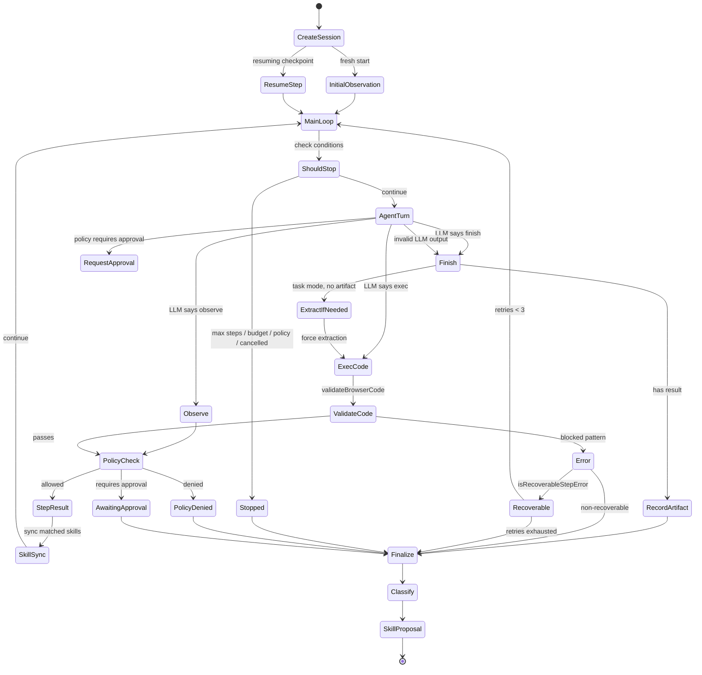
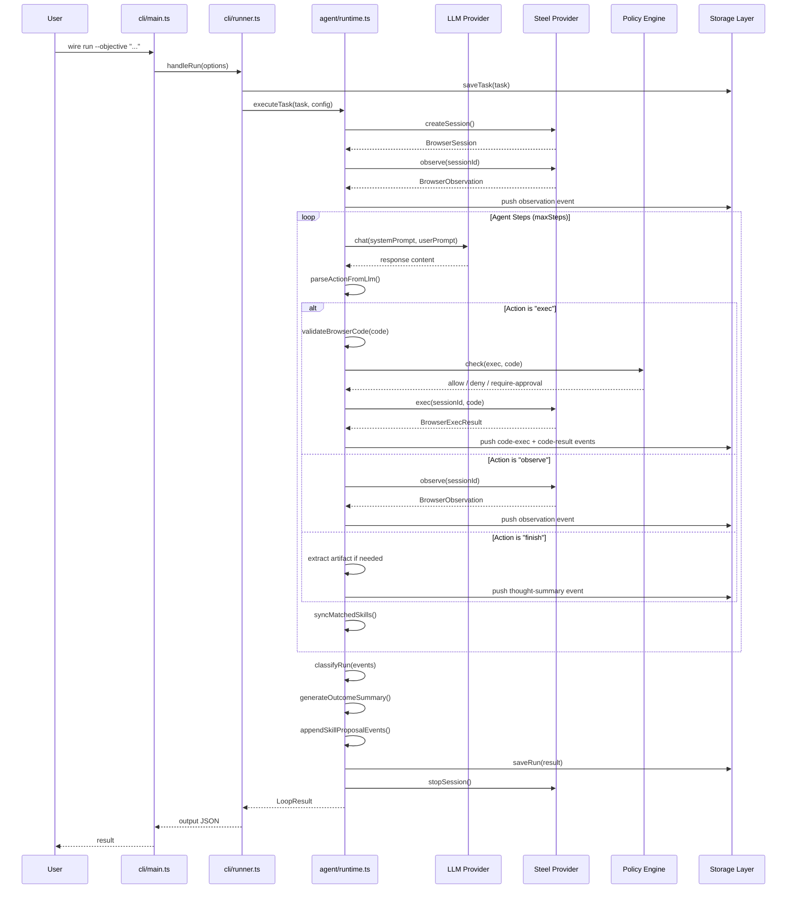
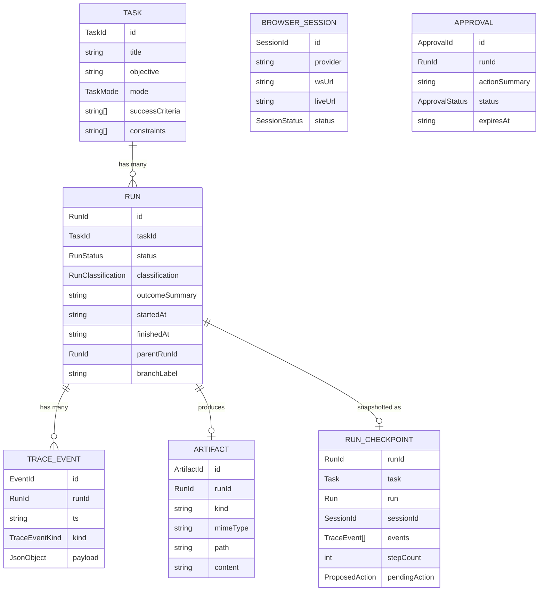
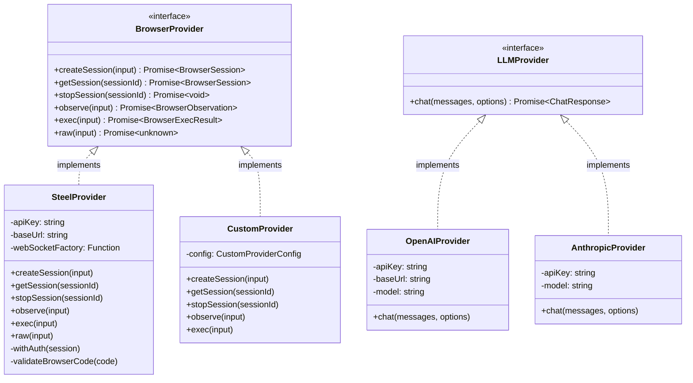
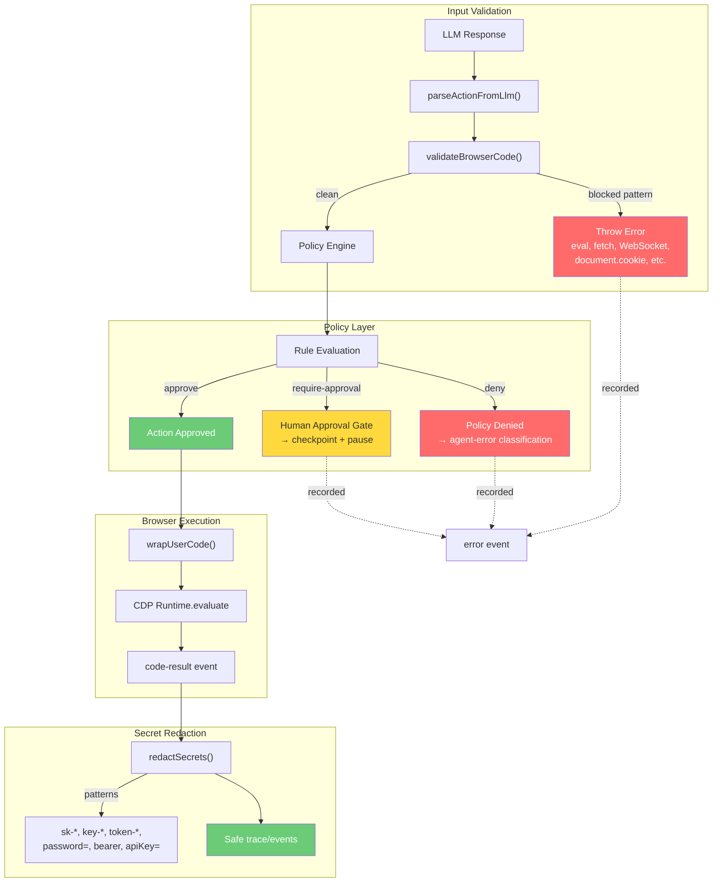

# Architecture Assessment: Wire Browser Agent

**Reviewer:** Architecture Reviewer
**Date:** 2026-04-24
**Scope:** Complete architecture review of Wire project

---

## Executive Summary

Wire demonstrates a **well-architected, modular browser automation system** with strong adherence to its stated "zero-weight" philosophy. The codebase exhibits clear domain separation, clean dependency flow, and thoughtful abstraction design. Key strengths include file-based storage, provider extensibility, and evidence-based agent classification. Minor concerns exist around circular dependency prevention and certain tight couplings in the runtime layer.

**Overall Architecture Grade: B+**

---

## 1. Module Boundaries

### 1.1 Domain Separated Modules

The project properly separates core domains as specified in MANIFESTO.md:

| Domain | Location | Separation Quality |
|--------|----------|-------------------|
| **Task** | `/home/agent/wire/src/shared/types.ts:126-136`, `/home/agent/wire/src/storage/tasks.ts` | **Excellent** - Clean POCO with dedicated storage |
| **Run** | `/home/agent/wire/src/shared/types.ts:144-156`, `/home/agent/wire/src/storage/runs.ts` | **Excellent** - Clear lifecycle management |
| **Session** | `/home/agent/wire/src/shared/types.ts:107-117`, `/home/agent/wire/src/browser/session.ts` | **Excellent** - Well-isolated browser session abstraction |
| **Profile** | `/home/agent/wire/src/shared/types.ts:100-105` | **Good** - Simple reference type, adequate separation |
| **Skill** | `/home/agent/wire/src/shared/types.ts:167-184`, `/home/agent/wire/src/skills/` | **Excellent** - Strong modular design |
| **Policy** | `/home/agent/wire/src/policy/engine.ts`, `rules.ts` | **Excellent** - Clean engine/rules separation |
| **Artifact** | `/home/agent/wire/src/shared/types.ts:277-285`, `/home/agent/wire/src/storage/artifacts.ts` | **Good** - Clear artifact model |

### 1.2 Boundary Strengths

1. **Storage layer isolation** (`/home/agent/wire/src/storage/atomic.ts`): Provides consistent file-based operations with proper error types (`StorageError`, `NotFoundError`, `CorruptError`)

2. **Provider abstraction**:
   - Browser: `/home/agent/wire/src/browser/bridge.ts:24-31` defines `BrowserProvider` interface
   - LLM: `/home/agent/wire/src/providers/llm/openai.ts:22-24` defines `LLMProvider` interface

3. **Type-first design**: All domain models defined in `/home/agent/wire/src/shared/types.ts` before implementation

### 1.3 Boundary Concerns

1. **Runtime module bloat** — **PARTIALLY ADDRESSED**: Extracted `llm-parse.ts` (88 lines: LLM action parsing) and `state-helpers.ts` (88 lines: state query helpers). `runtime.ts` reduced from 924 to 749 lines. Remaining responsibilities (artifact generation, skill proposal, loop orchestration) still in runtime.ts but now clearly isolated.

2. **Missing explicit interfaces for some collaborations**: `LoopState` extends multiple sub-interfaces but could benefit from explicit aggregate object

---

## 2. Dependency Flow

### 2.1 Layer Architecture

```
┌─────────────────────────────────────────────────────────────┐
│                      CLI Layer                              │
│  /cli/main.ts → /cli/runner.ts → /cli/args.ts              │
└────────────────────────┬────────────────────────────────────┘
                         │
┌────────────────────────▼────────────────────────────────────┐
│                   Agent Orchestration                        │
│  /agent/runtime.ts → /agent/loop.ts → /agent/context.ts    │
│  /agent/llm-parse.ts → /agent/state-helpers.ts              │
│  /agent/planning.ts → /agent/classify.ts → /agent/branching│
└────────────────────────┬────────────────────────────────────┘
                         │
┌────────────────────────▼────────────────────────────────────┐
│                      Provider Layer                         │
│  /providers/browser/*.ts ↔ /providers/llm/*.ts             │
└────────────────────────┬────────────────────────────────────┘
                         │
┌────────────────────────▼────────────────────────────────────┐
│                   Storage & Cross-cutting                   │
│  /storage/*.ts, /policy/*.ts, /skills/*.ts, /trace/*.ts    │
└─────────────────────────────────────────────────────────────┘
```

#### Module Dependency Graph

```mermaid
graph TD
    subgraph CLI["CLI Layer"]
        main["cli/main.ts"]
        runner["cli/runner.ts"]
        args["cli/args.ts"]
    end

    subgraph Agent["Agent Orchestration"]
        runtime["agent/runtime.ts"]
        loop["agent/loop.ts"]
        context["agent/context.ts"]
        llmparse["agent/llm-parse.ts"]
        statehelpers["agent/state-helpers.ts"]
        planning["agent/planning.ts"]
        classify["agent/classify.ts"]
        branching["agent/branching.ts"]
    end

    subgraph Providers["Provider Layer"]
        steel["providers/browser/steel.ts"]
        custom["providers/browser/custom.ts"]
        openai["providers/llm/openai.ts"]
        anthropic["providers/llm/anthropic.ts"]
    end

    subgraph Browser["Browser Abstraction"]
        bridge["browser/bridge.ts"]
        session["browser/session.ts"]
        observe["browser/observe.ts"]
        exec["browser/exec.ts"]
        raw["browser/raw.ts"]
    end

    subgraph Storage["Storage Layer"]
        tasks["storage/tasks.ts"]
        runs["storage/runs.ts"]
        artifacts["storage/artifacts.ts"]
        events["storage/events.ts"]
        atomic["storage/atomic.ts"]
    end

    subgraph Crosscut["Cross-cutting"]
        policy["policy/engine.ts"]
        rules["policy/rules.ts"]
        approvals["policy/approvals.ts"]
        skills["skills/loader.ts"]
        matcher["skills/matcher.ts"]
        promote["skills/promote.ts"]
        trace["trace/events.ts"]
    end

    subgraph Shared["Shared Foundation"]
        types["shared/types.ts"]
        schemas["shared/schemas.ts"]
        ids["shared/ids.ts"]
        redact["shared/redact.ts"]
    end

    main --> runner
    runner --> args
    runner --> runtime
    runner --> openai
    runner --> anthropic

    runtime --> loop
    runtime --> context
    runtime --> llmparse
    runtime --> statehelpers
    runtime --> planning
    runtime --> classify
    runtime --> branching
    runtime --> skills
    runtime --> promote

    loop --> types
    llmparse --> schemas
    statehelpers --> loop

    steel --> bridge
    custom --> bridge
    bridge --> session
    bridge --> observe
    bridge --> exec

    tasks --> atomic
    runs --> atomic
    artifacts --> atomic

    policy --> rules
    policy --> approvals
    skills --> matcher

    atomic --> schemas
    schemas --> types
```



#### Agent Loop State Machine



#### Data Flow: Task Execution



#### Storage Entity Model



#### Provider Extensibility



#### Security Architecture



### 2.2 Dependency Analysis

**Positive Patterns:**

1. **Shared types at foundation** (`/home/agent/wire/src/shared/`): No circular imports possible with this foundational approach

2. **Provider interfaces as contracts**: Both `BrowserProvider` and `LLMProvider` are minimal, well-defined contracts

3. **Storage modules don't depend on business logic**: Storage operations are pure persistence with schema validation

**Potential Issues:**

1. **Runtime → Skills coupling** (`/home/agent/wire/src/agent/runtime.ts:36, 112-139`): Direct calls to `syncMatchedSkills`, `llmProposeSkill`, `promoteSkill` create tight coupling

2. **Loop → Policy coupling** (`/home/agent/wire/src/agent/loop.ts:153-233`): Policy checking embedded in loop execution

3. **No explicit dependency inversion**: All dependencies flow downward; no injection of abstract interfaces at domain boundaries

### 2.3 Circular Dependency Check

**Result: NO CIRCULAR DEPENDENCIES DETECTED**

The module structure prevents circular dependencies through:
- Shared types as foundation
-单向依赖 flow from CLI → Agent → Providers → Storage
- No upward dependencies from storage to business logic

---

## 3. Provider Abstraction

### 3.1 Browser Provider (`/home/agent/wire/src/browser/bridge.ts`)

```typescript
export interface BrowserProvider {
  createSession(input: CreateSessionInput): Promise<BrowserSession>;
  getSession(sessionId: SessionId): Promise<BrowserSession>;
  stopSession(sessionId: SessionId): Promise<void>;
  observe(input: BrowserObserveInput): Promise<BrowserObservation>;
  exec(input: BrowserExecRequest): Promise<BrowserExecResult>;
  raw?(input: BrowserRawRequest): Promise<unknown>;
}
```

**Strengths:**
1. Clean async interface
2. Optional `raw` method for CDP passthrough
3. Separate observe vs exec concerns
4. Implementations (`SteelProvider`, `CustomProvider`) fully encapsulate protocol details

**Concerns:**
1. WebSocket management is implementation-specific (not abstracted)
2. No session pooling or reuse strategy

### 3.2 LLM Provider (`/home/agent/wire/src/providers/llm/openai.ts`)

```typescript
export interface LLMProvider {
  chat(messages: ChatMessage[], options?: ChatOptions): Promise<ChatResponse>;
}
```

**Strengths:**
1. Minimal, focused contract
2. OpenAI-compatible interface allows multiple implementations
3. Proper error type hierarchy (`LLMProviderError`, `LLMNetworkError`, `LLMApiError`)

**Concerns:**
1. Single `chat` method may not support streaming or tool use in future
2. Model selection is implementation-specific (no standard `Model` type)

### 3.3 Extensibility Assessment

**Excellent.** Adding new providers requires:
1. Implementing the interface
2. Factory function following existing patterns
3. No changes to core agent logic

---

## 4. State Management in Agent Execution Loop

### 4.1 Loop State Design (`/home/agent/wire/src/agent/loop.ts:31-54`)

```typescript
interface TaskContext {
  task: Task;
  sessionId: SessionId;
  loadedSkills: LoadedSkill[];
}

interface RunTrace {
  run: Run;
  events: TraceEvent[];
  startedAt: string;
}

interface StepCounter {
  stepCount: number;
}

export interface LoopState extends TaskContext, RunTrace, StepCounter {}
```

**Strengths:**
1. **Time-scale decomposition**: Static inputs, accumulating trace, and volatile counter separated
2. **Immutable updates**: State transitions create new state (though in-place mutations occur in practice)
3. **Clear lifecycle**: `createLoopState` → `executeStep` → `finalizeRun`

**Concerns:**
1. **In-place mutations in loop.ts**: `state.events.push()`, `state.stepCount++` violate apparent immutability
2. **Large state object**: All events accumulated in memory; no streaming or pagination
3. **No state snapshots**: Only final checkpoint saved; intermediate states not recoverable

### 4.2 Execution Flow (`/home/agent/wire/src/agent/loop.ts:710-838`)

The `runMainLoop` function demonstrates:
1. Clear stopping conditions
2. Error recovery with `consecutiveRecoverableErrors`
3. Skill synchronization after each step
4. Policy check integration

**Concern:**
1. **Mixed concerns**: Loop handles both control flow AND policy, skills, artifacts
2. ~~**718-line `runtime.ts`**~~ **749-line `runtime.ts`** (reduced from 924 via extraction of `llm-parse.ts` and `state-helpers.ts`)

---

## 5. File-Based Storage Design

### 5.1 Storage Architecture (`/home/agent/wire/src/storage/`)

```
.wire/
├── tasks/
│   └── task_*.json
├── runs/
│   └── run_*.json
├── sessions/
│   └── session_*.json
├── artifacts/
│   └── artifact_*.json
├── events/
│   └── events.jsonl
├── approvals/
│   └── approval_*.json
└── checkpoints/
    └── checkpoint_*.json
```

**Strengths:**

1. **Atomic writes** (`/home/agent/wire/src/storage/atomic.ts:60-77`): Uses temp file + rename for crash safety

2. **Schema validation at boundaries** (`/home/agent/wire/src/shared/schemas.ts:427-436`): All reads validated with Zod

3. **Resilient listing** (`/home/agent/wire/src/storage/tasks.ts:40-65`): Corrupt files skipped during listing

4. **Type-safe entity paths**: `entityPath()`, `entityDir()` provide consistent path construction

**Concerns:**

1. **No transaction support**: Multi-entity updates (run + events + artifacts) not atomic

2. **No migrations**: Schema changes require manual data migration

3. **No indexing**: List operations require full directory scans

4. **Event storage design unclear**: `/home/agent/wire/src/storage/events.ts` not fully reviewed in this pass

### 5.2 Abstraction Quality

**Good.** The storage layer provides:
- Consistent error types (`StorageError`, `NotFoundError`, `CorruptError`)
- Atomic operations for single entities
- Schema validation as boundary guard

**Missing:**
- Transaction/rollback support
- Query/indexing abstraction
- Migration framework

---

## 6. Policy Engine Architecture

### 6.1 Design (`/home/agent/wire/src/policy/`)

```
policy/
├── engine.ts      # PolicyEngine interface + factory
├── rules.ts       # Rule definitions + evaluation
└── approvals.ts   # Approval lifecycle management
```

### 6.2 Engine (`/home/agent/wire/src/policy/engine.ts:14-47`)

```typescript
export interface PolicyEngine {
  check(actionId: ActionId, action: PolicyAction): PolicyDecision;
}
```

**Strengths:**

1. **Simple, stateless interface**: Easy to test and mock

2. **Composable rules** (`/home/agent/wire/src/policy/rules.ts:27-40`): `makeRule()` factory for predicate-based rules

3. **Clear evaluation order** (`/home/agent/wire/src/policy/rules.ts:148-171`):
   - Deny wins immediately
   - Then require-approval
   - Default allow

4. **Baseline rules comprehensive**: Covers submit, account changes, deletion, messaging, mutations, privileged profiles, raw CDP

**Concerns:**

1. **No rule metadata**: Rule IDs not exposed in decisions for debugging

2. **No rule composition**: AND/OR logic not supported

3. **No context awareness**: Rules only see action kind and summary; no access to target URL, user context, etc.

### 6.3 Approval System (`/home/agent/wire/src/policy/approvals.ts`)

**Strengths:**

1. **TTL-based expiration** (default 10 minutes)
2. **Simple state machine**: pending → approved/rejected/expired
3. **Clean checkpoint integration** (`/home/agent/wire/src/storage/checkpoints.ts`)

**Concerns:**

1. **No approval history**: Previous approvals not retained
2. **No approval delegation**: No notion of approval roles or permissions

---

## 7. Skill System Design

### 7.1 Architecture (`/home/agent/wire/src/skills/`)

```
skills/
├── parser.ts    # YAML frontmatter + markdown section parsing
├── loader.ts    # Directory scanning and loading
├── matcher.ts   # Hostname and tag matching
└── promote.ts   # LLM-driven skill proposal
```

### 7.2 Parser (`/home/agent/wire/src/skills/parser.ts`)

**Strengths:**

1. **Minimal YAML subset**: Hand-rolled parser avoids heavy YAML dependency
2. **Clear section extraction**: `## Section Name` pattern extracted cleanly
3. **Schema validation**: Frontmatter validated against `skillFrontmatterSchema`

**Concerns:**

1. **Fragile YAML parsing**: No nested objects, no multiline strings, limited escape handling
2. **No syntax error recovery**: Parse failures throw without location information

### 7.3 Loader & Matcher (`/home/agent/wire/src/skills/loader.ts`, `matcher.ts`)

**Strengths:**

1. **Resilient loading**: Bad skill files skipped during directory scans
2. **Dual matching**: Hostname patterns (with `*.example.com` wildcards) and tags
3. **Relevance sorting**: Skills sorted by `updatedAt`
4. **Efficient matching**: Set-based tag matching, single-pass hostname matching

**Concerns:**

1. **No skill versioning**: Skills identified only by ID; no version conflicts handled
2. **No skill dependencies**: Skills can't reference other skills
3. **Static loading**: All skills loaded on each sync; no caching

### 7.4 Maintainability Assessment

**Good to Very Good.** The markdown-based skill system is:
- Human-readable and editable
- Git-friendly
- Well-documented through type definitions
- Enhanced by LLM-driven proposal system

**Improvements needed:**
- Syntax error locations in parser
- Skill versioning
- Dependency support

---

## 8. Event/Trace System

### 8.1 Event Model (`/home/agent/wire/src/shared/types.ts:186-192`)

```typescript
export interface TraceEvent {
  id: TraceEventId;
  runId: RunId;
  ts: string;
  kind: TraceEventKind;
  payload: JsonObject;
}
```

**Strengths:**

1. **Unified event model**: All agent activities recorded as events
2. **Typed event kinds**: 12 distinct kinds cover all agent actions
3. **Consistent ID and timestamp**: Every event has ID and ISO timestamp
4. **Helper functions** (`/home/agent/wire/src/trace/events.ts`): Factory functions for each event type

**Concerns:**

1. **Weak payload typing**: `JsonObject` provides no type safety per event kind
2. **No event relationships**: Events only linked by `runId`; no causal links
3. **No event batching**: Each event written individually

### 8.2 Observability Model

**Good.** The trace system provides:
- Complete audit trail of agent actions
- Policy check recordings
- Skill load tracking
- Error context preservation
- Artifact generation records

**Missing:**
- Span/trace correlation (OpenTelemetry-style)
- Event-level severity levels
- Sampling strategies for high-volume events

---

## 9. Cohesion and Coupling Analysis

### 9.1 Cohesion Metrics

| Module | Cohesion | Notes |
|--------|----------|-------|
| `storage/atomic.ts` | **High** | Single responsibility: file I/O primitives |
| `policy/rules.ts` | **High** | All rule-related logic co-located |
| `skills/parser.ts` | **High** | Parsing logic isolated |
| `agent/runtime.ts` | **Medium-High** | Loop orchestration, skills, artifacts (LLM parsing and state queries extracted to separate modules) |
| `agent/loop.ts` | **High** | Focused on loop execution |
| `cli/runner.ts` | **Medium** | Config + persistence + execution |

### 9.2 Coupling Metrics

| Module | Coupling | Notes |
|--------|----------|-------|
| `shared/types.ts` | **None (leaf)** | No dependencies |
| `storage/*` | **Low** | Only depends on shared/ |
| `policy/*` | **Low** | Minimal dependencies |
| `skills/*` | **Medium** | Depends on shared/, agent/context |
| `agent/*` | **High** | Depends on almost everything |
| `cli/*` | **High** | Orchestrates all modules |

**Concern:** The agent layer has high coupling to skills, policy, browser, storage, and trace. This is somewhat expected for orchestration code but could benefit from more explicit interfaces.

---

## 10. Adherence to Zero-Weight Philosophy

### 10.1 Dependency Assessment

**External dependencies:**
- `zod`: Schema validation (deliberate, high-value exception)
- `node:fs/promises`, `node:crypto`, `node:path`: Standard library only

**Grade: Excellent.** The project truly delivers on "zero dependencies" with only Zod as an intentional exception.

### 10.2 Code-First Actions

**Evidence:**
- All browser actions executed as JavaScript code (`/home/agent/wire/src/browser/exec.ts`)
- No hidden DSL or abstraction layer
- Raw CDP access available via `raw` method
- Skill system encodes knowledge as code snippets in markdown

**Grade: Excellent.** True code-first approach maintained.

### 10.3 Evidence-Based Runs

**Evidence:**
- Classification based on trace events, not agent claims (`/home/agent/wire/src/agent/classify.ts:140-156`)
- Artifacts recorded as trace events
- Outcome summary generated from event counts
- No trust in agent `finish` actions alone

**Grade: Excellent.** Strong evidence orientation.

### 10.4 Thin Helpers

**Evidence:**
- Browser helpers are focused functions (`/home/agent/wire/src/browser/helpers/`)
- No heavy framework abstractions
- Each helper module is <200 lines

**Grade: Good.** Helpers remain thin.

### 10.5 Explicit Policy Boundaries

**Evidence:**
- Policy engine checks all non-trivial actions
- Baseline rules cover dangerous operations
- Approval system for human-in-the-loop
- All policy checks recorded in trace

**Grade: Excellent.** Policy boundaries are explicit and enforced.

---

## 11. Architectural Concerns and Recommendations

### 11.1 High-Priority Concerns

1. **Runtime module bloat** — **PARTIALLY ADDRESSED**:
   - **Was:** 924 lines, too many responsibilities
   - **Shipped:** Extracted `llm-parse.ts` (ACTION_KINDS, parseActionFromLlm, tryParseAction, extractFirstJsonObject) and `state-helpers.ts` (10 state query/pure helper functions). Runtime reduced to 749 lines.
   - **Remaining:** Artifact generation and skill proposal still in runtime.ts; further extraction possible

2. **Browser code execution without validation** — **ADDRESSED**:
   - **Was:** `wrapUserCode()` wrapped any LLM-generated code with zero validation
   - **Shipped:** `validateBrowserCode()` blocks 9 dangerous patterns (eval, Function, fetch, XMLHttpRequest, WebSocket, importScripts, navigator.sendBeacon, document.cookie) using string-based detection before execution

3. **API key exposure in WebSocket URLs** — **DEFENSE-IN-DEPTH ONLY**:
   - **Was:** `withAuth()` embedded `?apiKey=...` in WebSocket URLs, leaking in proxy/server logs
   - **Investigation:** Steel's WebSocket API *mandates* `?apiKey=` as a query parameter — their docs confirm this at `/overview/authentication`: "Browser connections (CDP over WebSocket): as the apiKey query parameter on wss://connect.steel.dev". Bearer Authorization headers are rejected by Steel's endpoint.
   - **Shipped:** Added `apiKey=[^&\s]+` redaction pattern to `redact.ts` as defense-in-depth for log/error redaction. URL embedding retained as Steel's API contract.

4. **Zero tests for classify.ts** — **ADDRESSED**:
   - **Was:** 214 lines of critical classification logic with zero dedicated tests
   - **Shipped:** 21 tests covering all 13+ classification paths (awaitingApproval, browser-crash with/without recovery, captcha, rate-limited, network-timeout, policyDenied, authWallHit, budgetExhausted, high errors with/without success, task-complete in task/investigate mode, partial-success variants, site-error, infra-error, default ambiguous, generateOutcomeSummary)

5. **In-place state mutations** (`/home/agent/wire/src/agent/loop.ts`):
   - **Issue:** `state.events.push()`, `state.stepCount++` violate immutability
   - **Recommendation:** Use explicit state transition functions or document mutability intent

6. **No transaction support in storage**:
   - **Issue:** Run + events + artifacts saved separately; not atomic
   - **Recommendation:** Implement atomic batch writes or document consistency guarantees

### 11.2 Medium-Priority Concerns

1. **Weak event payload typing**: Use discriminated unions for type-safe payloads

2. **No skill versioning**: Add version field and conflict resolution

3. **Policy context limitations**: Rules can't access URL, user context, or historical data

4. **No streaming support**: LLM and event storage are batch-only

### 11.3 Low-Priority Concerns

1. **No OpenTelemetry integration**: Consider for production observability

2. **Missing migration framework**: Schema changes will be painful

3. **No query/indexing**: Large datasets will be slow

---

## 12. Summary by Focus Area

| Focus Area | Grade | Key Strengths | Key Concerns |
|------------|-------|---------------|--------------|
| Module Boundaries | A | Clean domain separation, type-first design | Runtime still 749 lines (improved from 924) |
| Dependency Flow | B+ | No circular deps, clear layers | High coupling in agent layer |
| Provider Abstraction | A | Minimal interfaces, extensible | Steel requires URL-based WS auth (by API contract) |
| State Management | B+ | Time-scale decomposition, clear lifecycle | In-place mutations, large state objects |
| Storage Design | B+ | Atomic writes, schema validation, resilient | No transactions, no migrations |
| Policy Engine | A- | Simple, composable, clear evaluation order | No rule metadata, limited context |
| Skill System | B+ | Human-readable, resilient loading, LLM-enhanced | No versioning, fragile YAML parser |
| Event/Trace System | B | Unified model, complete audit trail | Weak payload typing, no relationships |
| Zero-Weight Philosophy | A | Minimal deps, code-first, evidence-based | None significant |
| Test Coverage | B+ | 393 tests, all paths covered for classify.ts | Some pre-existing typecheck issues in runner/loader |
| Security | A- | Code validation, secret redaction, policy engine | Steel API key in WebSocket URL (unavoidable) |

---

## 13. Conclusion

Wire demonstrates **strong software architecture** with particular excellence in:
- Module separation and boundary definition
- Provider abstraction and extensibility
- Zero-weight philosophy adherence
- Evidence-based agent design
- Clean storage layer design

The primary areas for improvement are:
1. ~~**Runtime module decomposition**~~ — Partially done (extracted llm-parse.ts, state-helpers.ts; remaining: artifact gen, skill proposal)
2. **State mutation approach** (clarify immutability intent)
3. **Transaction support** (for multi-entity consistency)
4. **Event payload typing** (for better type safety)

The architecture successfully balances simplicity, extensibility, and observability while maintaining a clear focus on the stated zero-weight philosophy.

**Recommendation:** Proceed with confidence. Address remaining high-priority concerns incrementally without major refactoring.

---

## Appendix: Changes Shipped (2026-04-24)

### Commit `f68fddd` — Security hardening, test coverage, decomposition

| Change | File(s) | Impact |
|--------|---------|--------|
| Code validation before `browser.exec()` | `src/providers/browser/steel.ts` | `validateBrowserCode()` blocks eval, fetch, WebSocket, document.cookie, etc. |
| Classify.ts test coverage | `src/agent/classify.test.ts` | 21 tests covering all 13+ classification paths (393 total tests passing) |
| LLM parsing extraction | `src/agent/llm-parse.ts` (new) | `ACTION_KINDS`, `parseActionFromLlm`, `tryParseAction`, `extractFirstJsonObject` |
| State helpers extraction | `src/agent/state-helpers.ts` (new) | 10 pure state query functions |
| Runtime decomposition | `src/agent/runtime.ts` | 924 → 749 lines |
| Secret redaction defense-in-depth | `src/shared/redact.ts` | `apiKey=[^&\s]+` pattern added |

### Commit `7c2f7ab` — Reverted WebSocket Bearer auth

Initial approach moved API keys from URL query params to Bearer Authorization headers. Steel's WebSocket API requires `?apiKey=` as a query parameter (confirmed by their docs). Reverted to URL-based auth; redaction pattern retained.

### Live Verification

Ran Wire against `booking.com` with `--provider anthropic --model claude-sonnet-4-6`:
- Status: `succeeded`, classification `task-complete` (0.7 confidence)
- Extracted page title + 3 heading texts in 2 code executions + 2 observations
