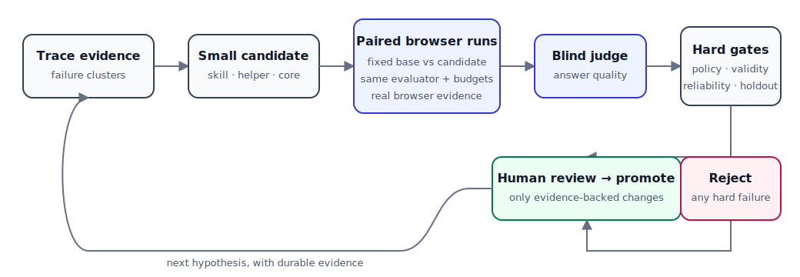

# Quality optimization campaign: what changed and what we learned

Date: 2026-07-19

Campaign: `quality-skills-zai-gemini-20260719-a`

Status: complete; one candidate promoted locally, one rejected

## The idea in plain language

Wire optimization is a controlled search for small changes that make the browser
agent more dependable. It is not an open-ended request for a model to rewrite the
system. The optimizer starts from a fixed version of Wire, proposes bounded
changes, runs the unchanged base and candidate on matching browser tasks, and
uses a blind judge plus hard safety gates to decide whether the evidence supports
promotion.

The object being optimized is task outcome quality: did Wire return the correct,
complete, contract-compliant answer? Reliability and wall time are measured
separately. The available levers are deliberately narrow:

- site-specific, durable skills that teach Wire how to observe a particular site;
- thin reusable helpers when a behavior applies across sites; and
- core changes only when the behavior is intrinsic to every Wire run.

This campaign tested the smallest lever first: two domain skills. Neither the task
suite nor judge rubric was mutable by candidates.

## How the evidence pipeline works

1. Freeze a base commit, evaluation suite, judge rubric, budgets, and promotion
   gates.
2. Generate a falsifiable candidate from trace/autopsy evidence.
3. Verify the candidate independently before spending browser runs.
4. Run paired base/candidate attempts on targeted, smoke, and broad suites.
5. Judge final answers blindly with Gemini; collect success, score, approvals,
   errors, and wall time from the controller.
6. Open a sealed holdout only after the public gates pass.
7. Require human review before local promotion. Any unresolved approval,
   infrastructure invalidity, or protected-file change rejects the candidate.

ZAI GLM-4.7 drove Wire during the browser tasks. Gemini 3.1 Pro Preview judged
the final outputs. The campaign consumed its exact 66-run physical budget with
two candidates, one-at-a-time execution, and no infrastructure failure.

## Why the evaluator changed first

The earlier smoke evaluation gave every successful answer a score of `1.0`, so it
could not separate adequate work from excellent work. Scaling that setup would
have produced more samples without more information.

The replacement rubric weights correctness and coverage most heavily, then the
requested output contract, specificity and honesty, and concision. It applies
explicit caps when a primary deliverable, required field, or requested format is
missing. A new seven-task suite requires exact counts, ordering, observed URLs,
and explicit unavailable values. Live calibration produced distinct scores for
complete, partial, malformed, and non-responsive fixtures: `1.00`, `0.29`,
`0.10`, and `0.15`.

## Results

### Promoted: executable Hacker News extraction skill

The HN candidate added a 987-byte domain skill with selectors and an executable
extraction strategy. It changed no core code, dependencies, evaluator inputs, or
lockfiles.

| Gate | Pairs | Base mean | Candidate mean | Base successes | Candidate successes |
| --- | ---: | ---: | ---: | ---: | ---: |
| Targeted | 6 | 0.6000 | 0.6500 | 3 | 4 |
| Smoke | 1 | 0.7500 | 0.7500 | 1 | 1 |
| Broad | 6 | 0.5583 | 0.6467 | 2 | 3 |
| Sealed holdout (aggregate only) | 6 | 0.7083 | 0.7333 | 4 | 4 |

Public HN pairs were repeatedly non-negative, including recovery of one comment
extraction flow. The holdout had no hard-validity issue. Latency was mixed—the
candidate was not consistently faster—so the promotion is a quality and
reliability decision, not a speed claim.

### Rejected: GitHub comparison extraction skill

The GitHub candidate improved mean judge scores in public gates, but introduced
an unresolved approval in a broad-suite run. That is a hard rejection regardless
of average score. It was not merged.

This is an important result rather than a failed experiment: the controller
prevented an apparently promising average from hiding a policy-boundary
regression.

## What we learned

- Measurement resolution is a prerequisite for useful optimization. The strict
  rubric exposed partial and malformed answers that the previous ceiling hid.
- A small site skill can improve a real extraction path without adding weight to
  core.
- Mean score alone is not a promotion rule. Safety and validity gates correctly
  overruled the GitHub candidate.
- Candidate latency is noisy and mixed. Future speed claims need a campaign
  designed and powered for latency rather than inferred from this quality study.
- Some broad-suite gains came from unrelated task variance. The HN conclusion is
  supported chiefly by repeated HN behavior plus a non-regressing sealed
  holdout, not by every aggregate movement.
- Trace/autopsy clusters still point to empty extraction and runtime/network
  failures as the largest remaining opportunity areas. Those clusters are
  hypotheses for the next candidates, not yet causal proof.

## Resulting repository state

The bounded campaign controller, protected evaluator inputs, blind Gemini judge,
strict quality rubric, and high-resolution suite are now integrated. The HN skill
is promoted on local `main`; the GitHub candidate remains isolated and rejected.
No remote push was performed.

Post-promotion verification passed:

- 993 core tests;
- 164 runnable optimizer tests, with 5 expected sandbox skips;
- architecture, typecheck, metrics, and diff checks;
- 20,089 production TypeScript LOC and 22,631 test TypeScript LOC.

The next campaign should form narrow candidates around the two dominant failure
clusters, increase repeated observations for the affected domains, and continue
to treat sealed holdout results as aggregate-only evidence.
